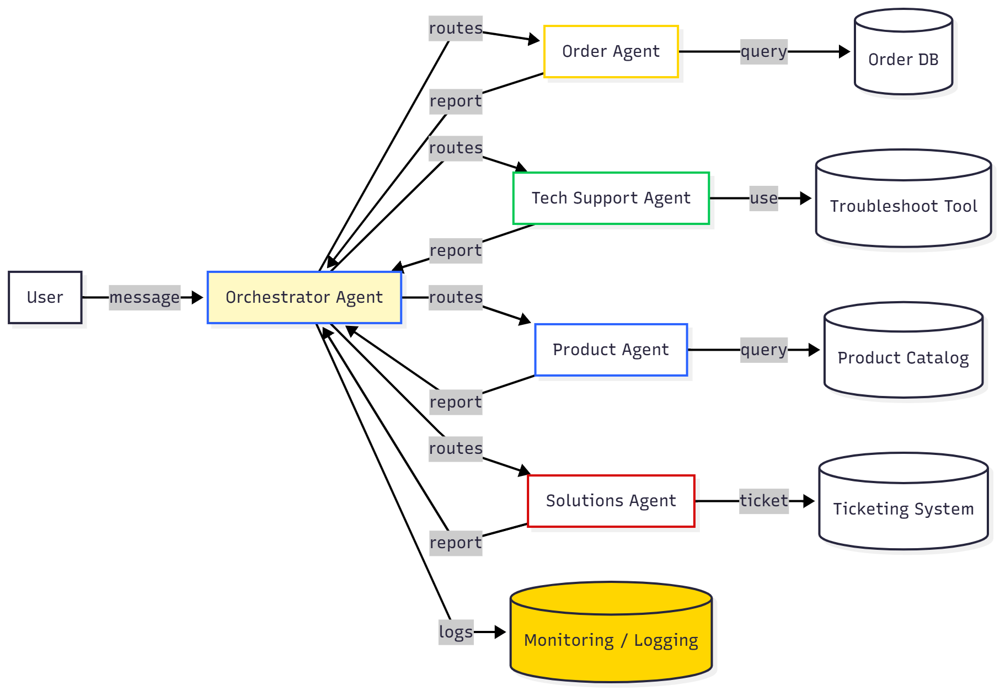

# Intelligent Multi-Agent Customer Support System

A **production-ready demonstration** of AI agents working together to deliver exceptional customer service. Multiple specialized agents coordinate seamlessly to handle orders, technical support, product inquiries, and problem resolution — showcasing an extensible pattern for automated customer care.

**Built with**: Python 3.10+, FastAPI, Streamlit, OpenAI GPT-4, Google Gemini 2.0-flash

##  **System Architecture**
- **Language**: Python 3.10+ (currently 3.13)
- **Backend**: FastAPI with async/await patterns
- **Frontend**: Streamlit with beautiful chat interface
- **AI Models**: OpenAI GPT-4 + Google Gemini 2.0-flash
- **Agent Coordination**: Sequential, Parallel, and Conditional execution modes

## 🧠 Agent Workflow Diagram

Below is the visual workflow for our customer support agents:



## 🚀 Quick Start

### 1. Set up Environment
```bash
# Activate virtual environment
source venv/bin/activate

# Install dependencies (Python 3.10+ required)
pip install -r requirements.txt
```

### 2. Configure API Keys (Optional)
```bash
# Copy environment template
cp .env.example .env

# Edit .env and add your API keys
OPENAI_API_KEY=your_openai_api_key_here
GEMINI_API_KEY=your_gemini_api_key_here
```

**Note**: The system works without API keys using mock responses for demonstration.

### 3. Choose Your Interface

#### Option A: Streamlit Demo (Recommended for Demos)
```bash
streamlit run streamlit_app.py
```
**Beautiful chat interface at: http://localhost:8501**
- 💬 Interactive chat with agent visualization
- 🤖 Real-time agent activity tracking
- 🧠 Memory context viewer
- 📋 Execution plan display

#### Option B: FastAPI Server (For API Access)
```bash
python main.py
```
**API available at: http://localhost:8000**
- 📖 Interactive docs at: http://localhost:8000/docs
- 🔧 RESTful endpoints for integration


## 🤖 How It Works

### Demo Scenario
Customer: *"My laptop order #12345 won't turn on, I need help!"*

1. **Orchestrator** analyzes request and creates execution plan
2. **Order Agent** retrieves order #12345 details and warranty info
3. **Tech Support Agent** provides troubleshooting steps for power issues
4. **Solutions Agent** offers resolution options (repair/replacement/refund)
5. **Orchestrator** synthesizes all responses into coherent customer service answer

### Multi-Agent System Components

1. **Orchestrator Agent** (`agents/orchestrator.py`)
   - Main coordinator that receives requests and manages specialist agents
   - Creates execution plans and synthesizes responses

2. **Specialist Agents**:
   - **Order Agent** (`agents/order_agent.py`) - Order lookups, tracking, returns
   - **Tech Support Agent** (`agents/tech_support_agent.py`) - Troubleshooting and technical help
   - **Product Agent** (`agents/product_agent.py`) - Product info, comparisons, recommendations  
   - **Solutions Agent** (`agents/solutions_agent.py`) - Returns, exchanges, problem resolution

3. **Supporting Systems**:
   - **Memory System** (`memory/session_memory.py`) - Conversation context and history
   - **Planning Module** (`planning/planner.py`) - Creates and validates execution plans
   - **Tool Library** (`tools/`) - Reusable functions for all agents

### Key Features

- ✅ **Works without API keys** (uses intelligent mock responses)
- ✅ **Real-time multi-agent coordination** with parallel/sequential execution
- ✅ **Session-based conversation memory** maintains context
- ✅ **Comprehensive logging** with colored output for demo visibility
- ✅ **30-second timeout protection** prevents hanging requests
- ✅ **Graceful error handling** with fallback strategies
- ✅ **RESTful API** with interactive documentation

### Project Structure
```
├── main.py                   # FastAPI backend server
├── streamlit_app.py          # Streamlit frontend interface
├── config.py                 # Configuration and API keys
├── agents/                   # Multi-agent system
│   ├── orchestrator.py       # Main coordinator
│   ├── order_agent.py        # Order management
│   ├── tech_support_agent.py # Technical support
│   └── solutions_agent.py    # Problem resolution
├── tools/                    # Agent capabilities
├── memory/                   # Session management
├── planning/                 # Agent coordination
└── data/                     # Mock data for demo
```

## **Known Limitations**

- **API Rate Limits**: OpenAI and Gemini APIs have rate limits for free tiers
- **Response Time**: Complex requests can take 20-30 seconds with real AI calls
- **Mock Data**: Limited to demonstration scenarios (3 orders, 4 products)
- **Memory Persistence**: Sessions cleared on restart (no database persistence)

## 🚀 **Future Scope**

- **Multi-modal AI**: Image, voice, and document processing capabilities
- **Database Integration**: PostgreSQL/MongoDB for persistent storage
- **Learning Agents**: Self-improving AI that learns from customer interactions
- **Enterprise Features**: Authentication, analytics dashboard, CRM integrations
- **Scalability**: Kubernetes deployment with auto-scaling
- **Voice Support**: Phone and omnichannel customer service integration

## What this code solves (problem statement)
- Fragmented support workflows: coordinates multiple specialist capabilities (order lookup, diagnostics, solutions) so customers get consistent, actionable responses.
- Slow and inconsistent triage: auto-generates an execution plan and routes tasks to appropriate agents to reduce latency and human handoffs.
- Loss of context across interactions: session-based memory keeps conversation history, customer attributes, and entities (orders, products, issues) for coherent multi-turn support.
- Demoability without infra: mock-mode lets teams prototype agent interactions and UX without API keys or expensive model calls.
- Extensible testing surface: deterministic mock responses make automated tests and reproducible QA simple.

## High-level code responsibilities (what each module does)
- main.py
  - Exposes REST endpoints (/chat, /demo, /reset). Receives requests, validates schemas, and forwards them to the orchestrator.
- streamlit_app.py
  - Lightweight demo UI for interactive chat, visualization of agent plans, memory view, and step-by-step execution tracing.
- agents/orchestrator.py
  - Central coordinator: analyzes input, composes an execution plan (sequential/parallel/conditional), dispatches tasks to specialist agents, collects results, and synthesizes the final reply.
  - Implements retries, timeouts, and fallback behaviors for robust orchestration.
- agents/*.py (order_agent, tech_support_agent, product_agent, solutions_agent)
  - Specialist capabilities encapsulated as small, testable units:
    - Order Agent: fetches order metadata, validates ownership/warranty.
    - Tech Support Agent: runs diagnostic flows, proposes troubleshooting steps, decides escalation.
    - Product Agent: supplies specs, compatibility checks, recommendations.
    - Solutions Agent: decides on returns, repairs, or compensations and formats next steps.
- planning/planner.py
  - Builds, validates, and optimizes execution plans based on input intent, session context, and policy constraints.
- memory/session_memory.py
  - In-memory session store that:
    - Tracks messages (role, timestamp, agent/tools used).
    - Auto-extracts entities (order numbers, products, common issues).
    - Expires idle sessions and provides contextual payloads for agents.
- tools/
  - Small helpers and adapters (mock data loaders, API wrappers, policy checkers) used by agents.
- data/
  - Mock datasets (orders, products) used in demo/mock mode so the system functions without external services.
- start_demo.py
  - Convenience launcher for starting Streamlit, FastAPI, or running packaged tests locally.

## Typical data flow (example)
1. User posts: "My laptop order #12345 won't turn on."
2. main.py validates request and passes to orchestrator.
3. Orchestrator consults memory for session context and asks planner for an execution plan.
4. Order Agent verifies order #12345 and returns warranty/status.
5. Tech Support Agent runs diagnostic checks (simulated or via model) and returns troubleshooting steps.
6. Solutions Agent combines warranty status + diagnostics to propose next steps (repair/replacement/refund).
7. Orchestrator synthesizes agent outputs into a single, customer-facing message and stores messages in session memory.

## How to extend or adapt the code
- Add agents by following the specialist agent pattern: implement a single responsibility, deterministic tests, and a clear input/output contract.
- Persist memory by swapping session_memory with a DB-backed implementation (same interface).
- Add tools for external APIs in tools/ and inject them into agents via the orchestrator/planner.
- Replace mock adapters with real clients by setting API keys in .env (config.py reads keys).

## Running & testing (concise)
- Create venv & install deps:
  - Windows (PowerShell):
    - python -m venv venv
    - .\venv\Scripts\Activate.ps1
    - pip install -r requirements.txt
- Run UI:
  - streamlit run streamlit_app.py
- Run API:
  - uvicorn main:app --reload --host 0.0.0.0 --port 8000
- Run quick demo:
  - python start_demo.py streamlit
- Run packaged tests:
  - python start_demo.py test

## Notes for developers
- Default session timeout is configurable in memory/session_memory.py (3600s by default).
- Mock mode is deterministic — useful for CI and local development.
- Increase REQUEST_TIMEOUT in config.py for slow model responses or long-running tools.


